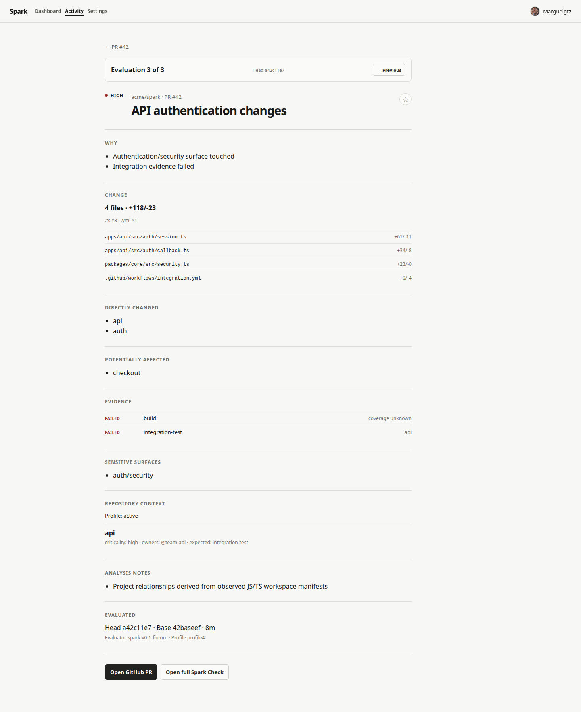
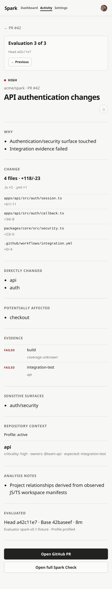

# Repository-Understanding UI Compatibility Audit

Status: complete visual-first audit for UIA-001–UIA-005.

Audit date: 2026-08-31. UI source commit: `32b1891907c10e1937e6e7b18963260985285e37`.

## Decision

The current UI is compatible with the new repository-understanding foundation because it consumes `EvaluationDetailV1` and other legacy projection contracts. It does not consume `RepositoryUnderstanding`.

That boundary is working as intended: attention, reasons, projected area labels, sensitive-surface labels, evidence status/coverage, and compressed analysis notes remain usable. It is also necessarily lossy. The UI cannot currently distinguish observations from claims, show support or uncertainty, explain why a relationship exists, or separate evidence execution from attribution and expectation.

No production UI, CSS, endpoint, persistence, or dashboard-contract change is justified by this audit alone. `EvaluationDetailV1` remains frozen. The first eligible UI addition is a separately versioned inspection view after bounded inspection serialization exists.

## Classification vocabulary

| Classification | Meaning |
| --- | --- |
| Exact | The visible value is the same stable policy projection that current consumers expect. |
| Compatible-lossy | The visible value is truthful, but identity, support, links, alternatives, or completeness were intentionally removed. |
| Absent | The concept is not represented by the current dashboard contract or UI. |
| Misleading | The value is real, but current wording encourages a stronger semantic conclusion than the model supports. |

“Misleading” can qualify an otherwise exact or compatible projection. It does not mean the current value is fabricated.

## Visual baseline manifest

The capture spec uses the existing fixture API and Playwright projects. Desktop is `1440×900`; mobile is `390×844`. Full-page height varies with content.

| Surface | Fixture route and state | Desktop | Mobile | UI source commit |
| --- | --- | --- | --- | --- |
| Activity | `/app/activity?window=7d&attention=ALL`; normal fixture | [`activity-desktop-1440x900.png`](./assets/repository-understanding-ui-audit/activity-desktop-1440x900.png) | [`activity-mobile-390x844.png`](./assets/repository-understanding-ui-audit/activity-mobile-390x844.png) | `32b1891` |
| PR trajectory | `/app/repositories/101/pulls/42?window=7d&attention=ALL`; forensics expanded by keyboard | [`pull-request-trajectory-desktop-1440x900.png`](./assets/repository-understanding-ui-audit/pull-request-trajectory-desktop-1440x900.png) | [`pull-request-trajectory-mobile-390x844.png`](./assets/repository-understanding-ui-audit/pull-request-trajectory-mobile-390x844.png) | `32b1891` |
| Evaluation detail | `/app/repositories/101/runs/fixture%3A101%3A42%3A0?window=7d&attention=ALL`; latest immutable run | [`evaluation-detail-desktop-1440x900.png`](./assets/repository-understanding-ui-audit/evaluation-detail-desktop-1440x900.png) | [`evaluation-detail-mobile-390x844.png`](./assets/repository-understanding-ui-audit/evaluation-detail-mobile-390x844.png) | `32b1891` |
| Historical unavailable | `/app/evaluations/101/aa37f103fb3838b5192dd31259b3755700000037?window=30d&attention=ALL`; legacy record | [`historical-unavailable-desktop-1440x900.png`](./assets/repository-understanding-ui-audit/historical-unavailable-desktop-1440x900.png) | [`historical-unavailable-mobile-390x844.png`](./assets/repository-understanding-ui-audit/historical-unavailable-mobile-390x844.png) | `32b1891` |

### Selected baseline pair

| Evaluation detail — desktop | Evaluation detail — mobile |
| --- | --- |
|  |  |

## Representative model-to-UI cases

| Case | Canonical understanding | Current compatibility projection | Visible UI | Audit result |
| --- | --- | --- | --- | --- |
| C1 — Spark localized workspace change | Project areas, path memberships, and supported `DEPENDS_ON` claims | `directAreas`, `affectedAreas`, and `Project[]` strings | “Directly changed” and “Potentially affected” lists; trajectory may show added labels | Exact for the selected labels; relationship identity, support, and alternate memberships are lost. |
| C2 — Stint provider change | Generic structural area `internal/provider/vast` supported by changed artifacts; later Go/profile claims may coexist | The active product remains on the prior V1 evaluation until shadow adoption; a new projected label is not yet published | Existing records can remain `Repository root` or unavailable; no structural claim inspection exists | Compatible during shadow rollout, but the improved model is absent from the product UI until G5/G6 adoption. |
| C3 — Security/CI boundary change | Boundary claims link kinds, artifacts, and zero or more areas | `sensitiveSurfaces: ['auth/security']` plus attention reasons | Activity label, “Why,” “Sensitive surfaces,” and transition cause | Exact label, lossy boundary semantics. “Sensitive surfaces” hides kind, files, connected areas, and support. |
| C4 — Overlapping structural/project/functional areas | Multiple memberships may connect one artifact to `api`, `auth`, and a structural region | Projector selects display-eligible labels and omits unselected views | Flat “Directly changed” strings | Compatible-lossy and potentially misleading: no indication that labels are selected views rather than exclusive canonical areas. |
| C5 — Evidence execution, attribution, and expectation | Duplicate EvidenceRuns remain facts; attribution and expectation are separate supported claims | Evidence name/status plus `string[] | UNKNOWN`; profile may separately list expected evidence | One flat Evidence row and optional profile metadata | Run status is preserved, but execution/attribution/expectation distinctions and attribution rationale are absent. |
| C6 — Incomplete tree or analyzer | Independent source and dimension completeness; analyzer failure remains source-scoped | One `AnalysisCompleteness` summary and notes | “Analysis notes,” or no structured limitation when detail is historical | Truthful but compressed. The UI cannot show which source/dimension is incomplete or which conclusions remain safe. |

## Complete concept classification

### Observation layer

| Canonical concept | Current representation | Classification | Required evolution |
| --- | --- | --- | --- |
| Repository snapshot identity and revision | Head/base SHA only on evaluation detail | Compatible-lossy | Inspection view should name snapshot source and exact revision independently from the change. |
| Change observation | PR identity, head/base SHA, change summary | Compatible-lossy | Preserve; add observation identity/source only in the inspection contract. |
| Artifact observation | Changed path and status; evaluation detail visually shows at most eight files | Compatible-lossy | Show membership/boundary links from an artifact without turning every artifact into an area. |
| Artifact-change status | File status and optional additions/deletions | Exact | No product change required. |
| EvidenceRun | Name and status; URL exists in V1 but is not rendered in the evidence row | Compatible-lossy | Keep duplicate runs and expose provider/revision/run link in the future evidence-run view. |
| Observation source | Not exposed | Absent | Add only to “How Spark knows”/inspection metadata. |
| Per-source observation completeness | Compressed analysis notes or unavailable state | Compatible-lossy | Add structured source completeness after RU-206 and bounded serialization. |

### Claim and semantic layer

| Canonical concept | Current representation | Classification | Required evolution |
| --- | --- | --- | --- |
| Claim provenance | Not exposed | Absent | Show analyzer/profile/provider source in the inspection view. |
| Derivation (`DECLARED`, `DETERMINISTIC`, `HEURISTIC`) | Not exposed | Absent | Pair derivation with provenance; never infer it from confidence styling. |
| Confidence (`SUPPORTED`, `TENTATIVE`, `UNKNOWN`) | Indirectly suggested by notes and fallback labels | Absent | Add explicit text labels after confidence semantics pass shadow validation. |
| Evidence references supporting a claim | Not exposed | Absent | Link claims to artifact/run observations in inspection. |
| Claim completeness | Not exposed | Absent | Keep separate from confidence and source completeness. |
| Area stable ID, label, role, and hierarchy | Label strings only | Compatible-lossy | Add stable identity and roles to a versioned understanding contract; do not place IDs in reviewer copy. |
| AreaMembership and classification view | Selected direct label only | Compatible-lossy; misleading wording | Show overlapping views and the matched artifact/path in “Change understanding.” |
| Typed AreaRelationship | `DEPENDS_ON` may become an affected label; all other types omitted | Compatible-lossy | Show relationship type and rationale only when supported; do not imply all affected labels are dependencies. |
| Boundary kind, artifacts, and connected areas | Flattened sensitive-surface label | Compatible-lossy; misleading wording | Use a boundary card linked to files/areas after G5. |
| EvidenceAttribution | Coverage strings or `UNKNOWN` | Compatible-lossy; misleading wording | Rename to attributed scope and expose the rule/support that made the attribution. |
| EvidenceExpectation | Profile `expectedEvidence` may appear separately; otherwise absent | Compatible-lossy | Add a distinct Expected/Missing group only after RU-304/RU-305. |
| CompletenessAssessment | Analysis note text | Compatible-lossy | Render source/dimension/state/reason without converting uncertainty into attention. |
| RepositoryUnderstanding aggregate | No current contract | Absent | Introduce a bounded, versioned inspection resource; keep V1 evaluation independent. |

### Policy projection and diagnostics

| Projection/diagnostic | Current UI | Classification | Required evolution |
| --- | --- | --- | --- |
| Attention | Activity, PR, detail, trajectory, and history | Exact | Preserve through G5; policy changes remain RU-604. |
| Reasons | “Why this state,” evaluation “Why,” transition causes | Exact | Preserve; later link a reason to relevant claims without rewriting it. |
| Changed files | Summary plus bounded file list | Exact within current UI bound | Preserve current behavior. |
| Direct-area labels | “Directly changed” | Exact projection; misleading wording | Eventually use “Changed areas” and disclose selected/overlapping views. |
| Affected-area labels | “Potentially affected” and transition causes | Exact projection; misleading wording | Eventually use “Dependency-affected areas” when the cause is `DEPENDS_ON`. |
| Sensitive-surface labels | Activity, detail, transition causes | Exact projection; misleading wording | Retain label compatibility; later display boundary structure. |
| Evidence status | Detail rows, summaries, issues, trajectory | Exact | Preserve status text and duplicate executions. |
| Evidence coverage | Coverage string/`UNKNOWN` | Exact projection; misleading wording | Replace user-facing “coverage” with “attributed scope” when the new evidence contract is adopted. |
| Analysis summary/notes | Evaluation “Analysis notes” | Exact projection; lossy | Add structured completeness beside—not instead of—existing notes during migration. |
| Project/profile context | Profile state and matched profile metadata; project graph itself hidden | Compatible-lossy; misleading grouping | Split repository understanding from profile enrichment. |
| Normalization issues | Not exposed | Absent | Developer inspection only; never default reviewer content. |
| Analyzer execution issues | At most a compressed completeness note | Compatible-lossy | Developer inspection first; product limitation banner only after G5 classification. |
| Projection losses | Not exposed | Absent | Developer inspection should list applied loss rules. |
| Stable-ID trajectory | String set deltas | Absent | Version trajectory only after canonical persistence/adoption. |

## Visual and interaction findings

### Activity

The activity surface remains fit for compatibility mode. It answers prioritization questions with attention, file counts, a latest evidence summary, and at most one surface label. Adding claim/model detail here would weaken the operational scan. Keep this surface on V1 until controlled adoption.

### Pull-request trajectory

The trajectory accurately presents policy history, evidence health, and projected label deltas. Its “Observations” section currently means deterministic trajectory insights, not repository observations. The expanded mobile capture is already very long; equal-weight model diagnostics must not be appended inline. A later inspection view should be linked or placed behind a distinct disclosure.

### Evaluation detail

This is the correct future product location for repository understanding, but the current page is a flat sequence of projection sections. Desktop scanning is clear; mobile already becomes a long single column. Future “Change understanding” and “How Spark knows” content needs grouped summaries with bounded progressive disclosure, not additional unbounded lists.

### Historical unavailable

The unavailable state is truthful and should remain unchanged. It does not fabricate understanding from records that never retained detail. Future V2 readers must continue falling back to this state for legacy records.

### Accessibility

- Attention and evidence state are written as `LOW`/`MEDIUM`/`HIGH` and `PASSED`/`PENDING`/`FAILED`/`MISSING`; colour is supplemental.
- The audit capture rejects positive `tabindex` values, preserving natural DOM order.
- The PR forensic disclosure is operable using keyboard focus and Enter.
- Existing headings establish the visual and accessibility hierarchy used in the comparison.

## Terminology conflicts

| Current copy | Conflict | Eligible replacement | Gate |
| --- | --- | --- | --- |
| Observations | Means trajectory insights today; canonical observations are provider facts | “Trajectory observations” or “Detected transition patterns” | Rename only when an understanding inspection view introduces canonical observations, after RU-502. |
| Directly changed | Implies an exclusive canonical area assignment | “Changed areas,” with selected/overlapping view disclosure | G5 shadow validation and stable selection policy. |
| Potentially affected | Does not state that current propagation is supported `DEPENDS_ON` traversal | “Dependency-affected areas” where that relationship is known | G5, after relationship parity. |
| Sensitive surfaces | Collapses all boundary structure into a label | “Boundaries and sensitive surfaces” | G5, when boundary artifacts/areas are available to the UI. |
| coverage / coverage unknown | Can be read as test coverage rather than evidence attribution | “attributed scope” / “scope attribution unknown” | G3 evidence projection plus G5 UI validation. |
| Repository context | Mixes profile enrichment with repository-native understanding | Separate “Repository understanding” and “Profile enrichment” | G4 profile enrichment plus G5 shadow validation. |

## Gated UI-evolution backlog

| ID | Recommendation and audit case | Backend prerequisite | Compatibility boundary | Visual acceptance evidence |
| --- | --- | --- | --- | --- |
| UIE-001 | Add a developer “How Spark knows” inspection view for C2/C4/C6 | RU-502 bounded inspection serialization | Separate versioned resource; no `EvaluationDetailV1` fields added | Spark/Stint desktop and mobile captures show claims, support, completeness, diagnostics, and explicit truncation. |
| UIE-002 | Add structured completeness and analyzer limitations for C6 | RU-206 and RU-502; mismatch classes stable in RU-504 | Developer view first; product banner cannot alter attention | Complete, partial-tree, failed-analyzer, and unavailable states remain distinguishable without colour. |
| UIE-003 | Split Evidence into Runs, Attributions, and Expectations for C5 | RU-301–RU-306 and G5 shadow validation | Keep V1 evidence rows during dual-path comparison | Duplicate runs, unknown attribution, explicit area attribution, expected-missing, and conflicting statuses have bounded desktop/mobile states. |
| UIE-004 | Replace flat area lists with “Change understanding” for C1/C2/C4 | RU-203–RU-208 and RU-504 | Display labels stay compatible; stable IDs remain internal | Localized, overlapping, hierarchy, dependency fan-out, and unmapped cases explain selected views and support. |
| UIE-005 | Render boundary cards linked to artifacts/areas for C3 | RU-205, RU-206, and RU-504 | Retain current sensitive labels in summaries and trajectory | Security, CI, deployment, dependency, and boundary-with-no-area cases render truthfully. |
| UIE-006 | Split Repository understanding from Profile enrichment for C1/C4 | RU-401–RU-405 and RU-504 | Profile remains additive and never overwrites observed facts | Absent, active, invalid, overlapping, and conflicting profile states show source revision and coexistence. |
| UIE-007 | Keep Activity/PR summaries on V1 until adoption | RU-601 controlled canonical adoption | No pre-adoption summary or attention change | Existing eight baselines remain visually and semantically stable through G5. |
| UIE-008 | Version trajectory around stable area/boundary identities | RU-601/RU-602 and a trajectory migration decision | Historical V1 label deltas remain readable; no silent reinterpretation | Rename, overlap, and identity-preserving path-move cases do not manufacture removal/addition events. |
| UIE-009 | Preserve truthful historical unavailability | Versioned V2 detail reader | Never synthesize missing claims from V1 records | Existing unavailable desktop/mobile baselines remain the fallback for legacy records. |

## Contract direction

- Freeze `EvaluationDetailV1`, `EvaluationSummaryV1`, and current trajectory DTOs during G2–G5.
- Do not persist the unbounded canonical model in normalized-detail V1.
- After RU-502, expose bounded inspection data through a separate versioned resource with explicit truncation.
- After G5, define a product-facing understanding contract from validated display needs rather than returning raw internal arrays.
- Keep reviewer labels separate from stable IDs. IDs support links and trajectory identity; labels remain user-facing.
- Preserve rollback to the V1 projector until RU-601 completes.

## Validation record

| Check | Result |
| --- | --- |
| Dedicated visual capture, desktop and mobile | 8 passing; eight labelled PNGs retained above |
| Full Playwright suite | Pending final audit validation |
| Web unit tests | Pending final audit validation |
| Core projector parity | Pending final audit validation |
| Repository typecheck | Pending final audit validation |

## Audit completion

- UIA-001: eight labelled visual baselines retained with route, fixture state, viewport, and source commit.
- UIA-002: C1–C6 map canonical understanding through compatibility output to the current UI.
- UIA-003: every observation, semantic/support concept, policy projection, and diagnostic is classified.
- UIA-004: six concrete terminology conflicts are recorded with gated replacements.
- UIA-005: UIE-001–UIE-009 tie every evolution recommendation to backend prerequisites, compatibility boundaries, and visual evidence.
